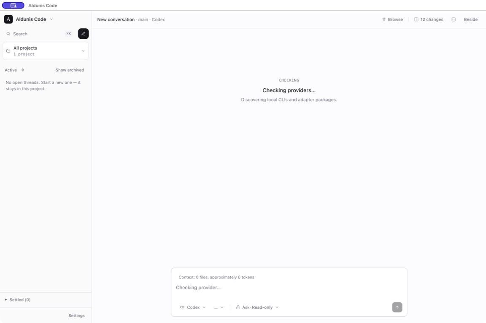
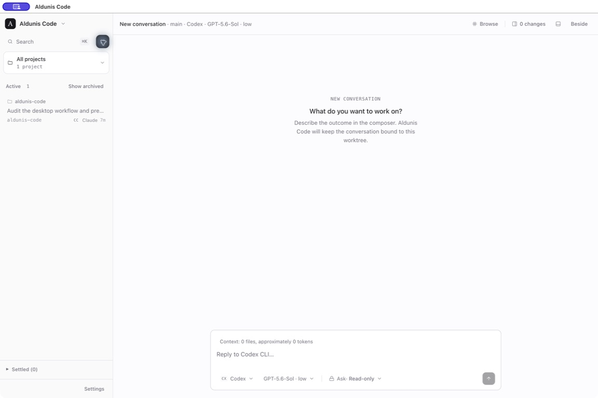

# Desktop provider-discovery recovery — Issue #360

Captured from the production Electron build on macOS on 2026-07-29. The
application used its supported 1440×960 default window; the current-session
capture service produced 1152×768 images.

## Reproduced defect

On the first cold launch, provider discovery remained on **Checking
providers…** for more than one minute. The composer, provider, model, and send
controls stayed disabled, and the screen exposed no timeout or retry action.
Closing and relaunching the same production build completed discovery within
seconds, confirming that provider installation and authentication were not the
blocking condition.

## Recovery

The client now bounds provider discovery to 30 seconds, above the host's
supported sequential probe budget. A stalled request is
aborted and resolves to the existing safe offline projection. The default Codex
draft then explains that discovery timed out and exposes **Retry provider
check**; successful discovery remains cached as before.

The live production build below shows the normal successful path after the
change. The timeout and retry transition is locked by a deterministic
never-settling fetch fixture because the real local provider probe settled on
subsequent launches.

## Audit coverage and limits

The current-session pass also exercised restored and new conversations,
provider/model/mode controls, a cancelled run, long and unbroken prompt text,
dual-pane mode, maximized dual-pane review with 12 changed files, reduced
motion, and the Settings navigation surface. Existing deterministic desktop
coverage retains the 920×640 minimum-window, default-window review, focus,
dialog, large-list, approval, diff, and dense-timeline fixtures.

The capture driver could not reliably resize the Electron window to an exact
920×640 frame or synthesize every macOS Command shortcut. Those cases were not
claimed from screenshots alone and remain covered by deterministic layout and
interaction tests.
