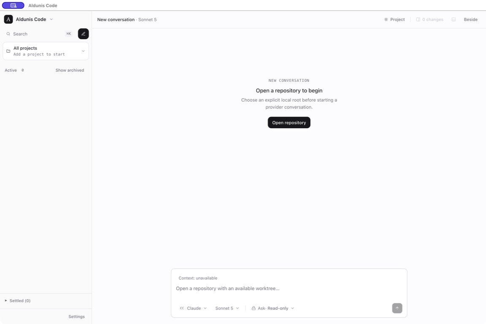

# Desktop startup evidence — Issue #343

Captured on macOS from the production Electron build on 2026-07-29.

## Before

`npm run desktop` completed both builds, then Electron failed before creating
an application window:

```text
Error: Dynamic require of "path" is not supported
    at node_modules/proper-lockfile/lib/lockfile.js
    at dist-electron/main.js
```

There is no before screenshot because the defect prevented the Aldunis Code
window from being created. The console failure above is the observable
pre-fix evidence.

## After

`npm run build` completed with `proper-lockfile` retained as a runtime import
in `dist-electron/main.js`. Launching `electron .` then created the Aldunis Code
window and restored its empty state at the supported default desktop size.



## Audit limit

This focused evidence belongs to the startup fix. The broader desktop audit
also reproduced excessive density when dual-pane mode and the review dock are
open at 1152×768; that finding is intentionally outside Issue #343.
