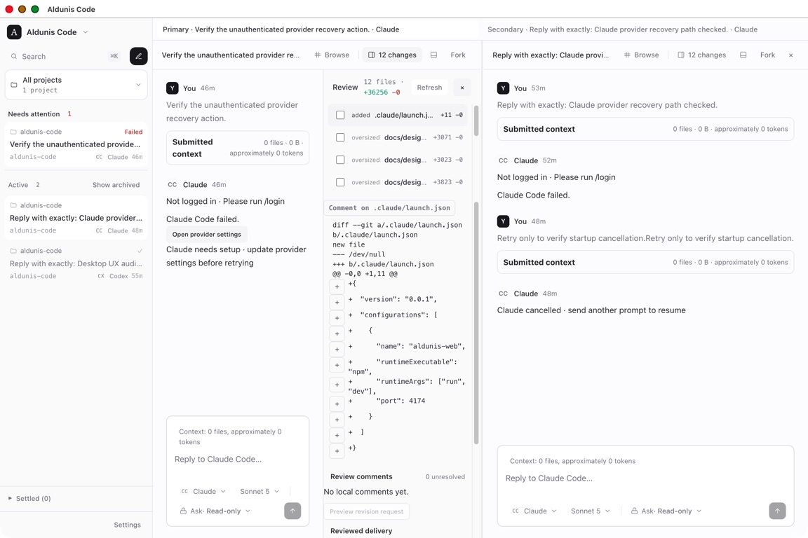
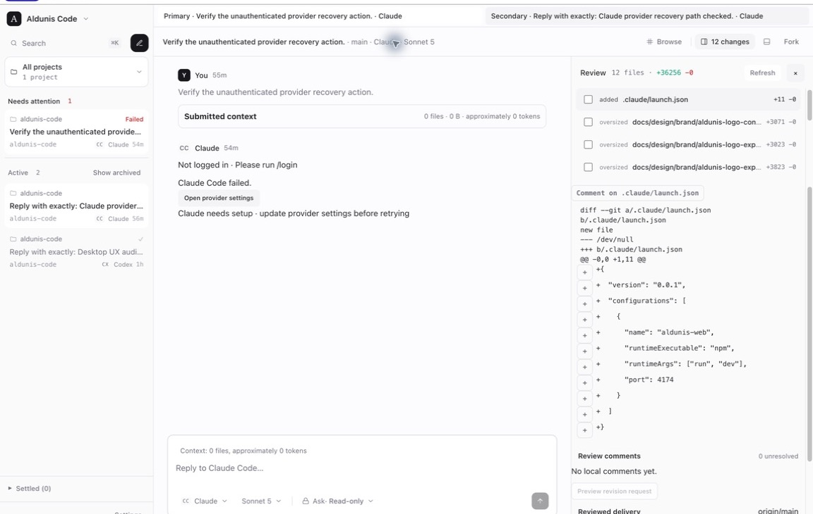
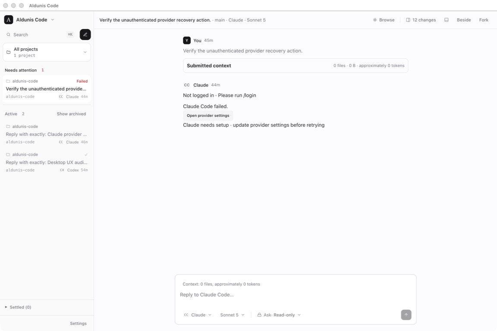

# Desktop UX audit evidence — Issue #354

Captured from the production Electron build on macOS on 2026-07-29. The
application window used its supported 1440×960 default; the current-session
capture service produced 1152×768 images.

## Audit scope

The live pass exercised:

1. Restored conversation selection and rapid primary/secondary switching —
   healthy.
2. A new-conversation draft with provider, model, and Ask/Plan/Build controls —
   healthy; no prompt was sent.
3. Claude setup/authentication failure and cancelled-run recovery — healthy,
   with an inline recovery action and provider-bound composer state.
4. Search and command-palette entry — healthy by pointer; keyboard shortcut
   behavior was inspected through the accessibility surface, but the capture
   driver did not reliably synthesize macOS Command shortcuts.
5. Dual-pane conversation work — healthy until a review dock was opened at the
   default desktop width.
6. Changed files, structured diff, line-comment controls, review comments, and
   reviewed-delivery controls — functional, but materially compressed in the
   reproduced dual-pane state.
7. Settings: General, Providers, Worktrees, Approvals, Access, Keybindings,
   Diagnostics, and Archived threads — healthy.
8. Reduced-motion mode — enabled (`Reduce`) throughout the live pass.

Approval cards were inspected structurally in the application and deterministic
tests, but no live provider emitted a new approval during this pass. Large-list,
long-output, unbroken-text, dense-timeline, interrupted, loading, and empty-state
coverage therefore also relies on the existing deterministic fixtures and style
verification rather than newly mutating the user's persisted conversations.

## Ranked findings

| Rank | Finding | Impact | Confidence | Outcome |
| --- | --- | --- | --- | --- |
| 1 | Opening review inside dual-pane at the supported 1440×960 default split the active half again, leaving conversation and review columns around 280px wide. Status copy wrapped heavily, changed-file paths became indistinguishable, and diff lines formed a dense vertical stream. | High | High — reproduced live and captured | Fixed in Issue #354 |
| 2 | Long conversation titles truncate in the sidebar and pane tabs. Full labels remain available through accessible names and title text; no control overlap was reproduced. | Low | High | No change |
| 3 | Provider authentication failure, cancellation, and retry states use different but clear recovery copy. The unauthenticated state exposes **Open provider settings** and preserves the provider-bound conversation. | Positive evidence | High | No change |

## Before

Both conversations remain visible while the primary pane is split again for
review. The changed-file list and diff compete with the conversation inside
half of the desktop workspace.

## After

At the default desktop width, opening review keeps both conversations mounted
but shows only the active pane through the existing pane switcher. Closing
review restores the side-by-side conversations. Displays wider than 1440px
retain side-by-side conversation and review presentation.

## Additional baseline

This current-session capture supports the positive recovery finding. It is not
part of the layout regression fixed by Issue #354.

